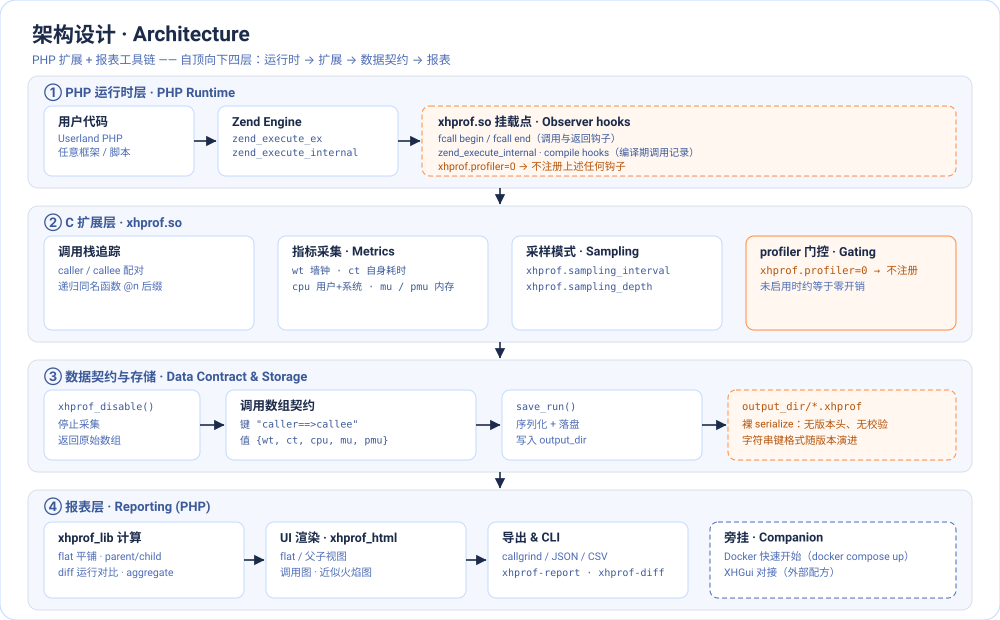
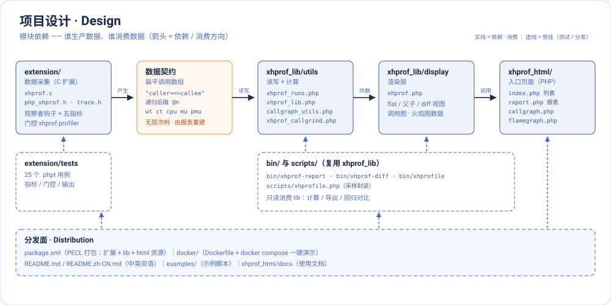
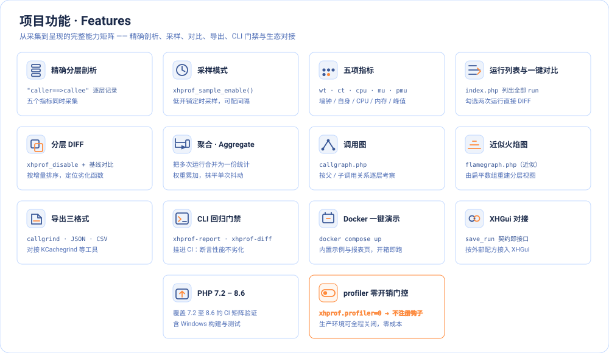
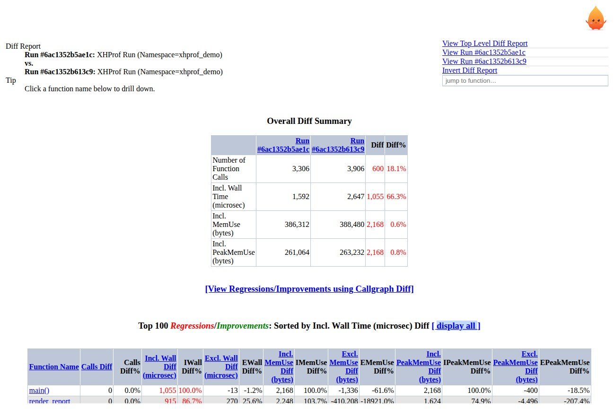
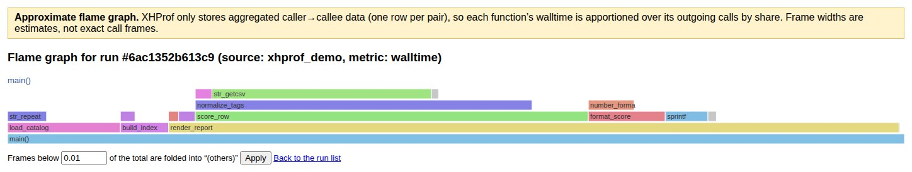
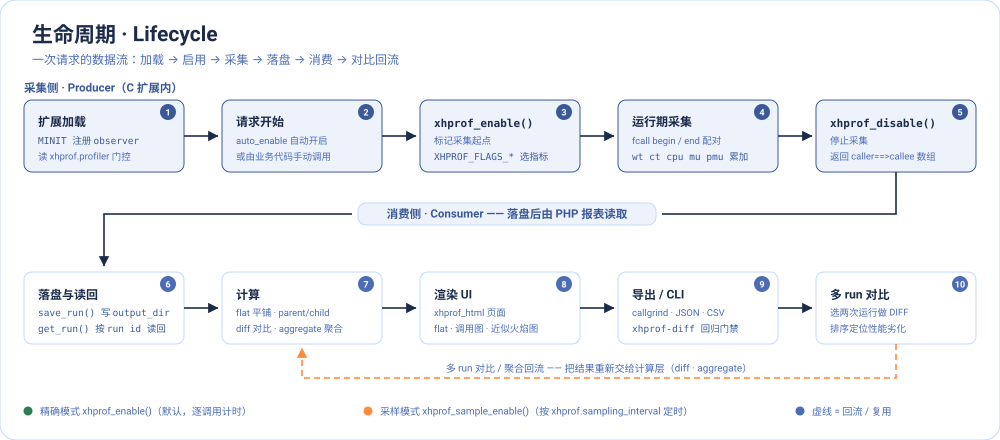

# xhprof for PHP7 and PHP8
**[English](README.md) | [简体中文](README.zh-CN.md)**
[](https://github.com/longxinH/xhprof/actions/workflows/ci.yml) [](https://ci.appveyor.com/project/longxinH/xhprof/branch/master)


XHProf is a function-level hierarchical profiler for PHP. The raw data collection component is implemented in C (as a PHP extension); the reporting/UI layer is all in PHP. It reports function-level inclusive and exclusive wall times, memory usage, CPU times and the number of calls for each function, and can compare two runs (hierarchical DIFF reports) or aggregate results from multiple runs.

Around that core this repository ships a complete toolchain: a web UI with a run list and one-click compare (flat, parent-child, DIFF and aggregate reports), a callgraph and a flame graph view (*approximate* for hierarchical runs, exact for sampled ones); callgrind, JSON, CSV and folded-stack exports; CLI tools (`bin/xhprofile`, `bin/xhprof-report`, and `bin/xhprof-diff` as a CI regression gate); a one-command Docker demo; and the `xhprof.profiler=0` gate that keeps the extension loaded at roughly the cost of not loading it. Supported on PHP 7.2 through 8.6.

# Why xhprof
- **Nothing leaves your machine.** Profiles are written to your `xhprof.output_dir` and stay there — no service, no upload, no telemetry.
- **Exact, not sampled.** Every call is counted and every wall/CPU/memory number is measured by the extension's hooks, which is what makes DIFF and aggregate reports meaningful.
- **The maintained lineage.** Published on PECL: the original Facebook project and the Tideways `php-xhprof-extension` fork are both archived and point users here, and the PHP manual links to this fork as well.

# Architecture

<p align="center"></p>

Four layers, top to bottom. Userland PHP runs on the Zend Engine, where `xhprof.so` attaches its observer hooks to function calls; the extension pairs callers with callees — recursive calls become `foo@n` — accumulates `wt`, `ct`, `cpu`, `mu` and `pmu`, and can sample instead of tracing every call. `xhprof_disable()` hands the flat `"caller==>callee"` array back to PHP, `save_run()` serializes it into `xhprof.output_dir`, and the reporting layer rebuilds the call hierarchy from it. Set `xhprof.profiler=0` and none of those hooks are registered at all.

# Design

<p align="center"></p>

Who produces the data and who consumes it. `extension/` (C) produces the flat call array; `xhprof_lib/` reads and computes on it — `utils/` for run I/O, callgraph data and callgrind export, `display/` for the renderer that builds the flat, parent-child and DIFF views; `xhprof_html/` is the web entry point, and `bin/` plus `scripts/` consume the same library from the command line. `extension/tests`, `package.xml` and `docker/` hang off the side as test and distribution surfaces.

# Features

<p align="center"></p>

One box per capability: exact hierarchical profiling and sampling, the five metrics, run list with one-click compare, hierarchical DIFF, aggregate, callgraph, the flame graph (approximate for hierarchical runs, exact for sampled ones), the four export formats, the CLI regression gate, the Docker demo and XHGui integration — plus the two properties that apply to all of them, PHP 7.2–8.6 support and the `xhprof.profiler` gate.

Two of those views in the browser (screenshots from the Docker demo data):

<p align="center">
  <br>
  <em>DIFF report — two runs compared: overall diff summary plus the top regressions/improvements by inclusive wall-time diff.</em>
</p>

<p align="center">
  <br>
  <em>Approximate flame graph (hierarchical run) — frame widths are correct, but the split below an aggregated edge is an estimate.</em>
</p>

# Lifecycle

<p align="center"></p>

One request, from load to report. The extension registers its observers at module init (unless `xhprof.profiler=0`); profiling starts through `xhprof.auto_enable` or an explicit `xhprof_enable()` with `XHPROF_FLAGS_*`, and while the request runs the hooks accumulate metrics per caller/callee pair. `xhprof_disable()` returns the raw array, `save_run()` writes it to `output_dir`, and the PHP side reads it back with `get_run()` to compute flat / parent-child / DIFF / aggregate results, render the UI, export, or run the CLI — comparing and aggregating runs simply flows back into that same computation layer.

# Project structure

```
xhprof/
├── extension/            # the PHP extension in C: xhprof.c, trace.h, php_xhprof.h
│   └── tests/            # 25 .phpt tests (metrics, gating, output)
├── xhprof_lib/
│   ├── utils/            # run I/O and computation: xhprof_runs, xhprof_lib,
│   │                     #   callgraph_utils, xhprof_callgrind
│   └── display/          # the report renderer (xhprof.php)
├── xhprof_html/          # the web UI: index.php, report.php, callgraph.php, flamegraph.php
│   ├── css/ js/          # stylesheet and the native report + flamegraph scripts
│   └── docs/             # user guide (index.html, index-fr.html) and screenshots
├── bin/                  # CLI: xhprofile (profile a script), xhprof-report, xhprof-diff
├── scripts/              # release script and the sampling wrapper (xhprofile.php)
├── docker/               # Dockerfile; docker-compose.yml at the root is the demo
├── examples/             # sample.php, the script the Docker demo profiles
├── resource/             # mascot and the architecture / design / features / lifecycle diagrams
├── .github/workflows/    # CI (PHP matrix); .appveyor.yml and travis/ are legacy
├── package.xml           # PECL package description
├── composer.json         # Composer metadata (PHP >= 7.2 + ext-xhprof; autoloads xhprof_lib, exposes the CLI)
├── CHANGELOG · CREDITS · LICENSE
└── README.md · README.zh-CN.md
```

# PHP Version
- 7.2
- 7.4
- 8.0
- 8.1
- 8.2
- 8.3
- 8.4
- 8.5
- 8.6 (pre-release; builds and passes the full test suite against 8.6.0RC2)

# Installation

## Quick start with Docker
No PHP toolchain required — one command builds the extension and serves the UI:
```sh
docker compose up
```
Then open <http://localhost:8080>. The container seeds one example run (`examples/sample.php`) on startup and stores runs in `/tmp/xhprof`.

The UI itself — run list and compare, flat / parent-child / diff reports, aggregate, callgraph, flame graph, exports — is documented in [xhprof_html/docs/index.html](xhprof_html/docs/index.html).

## Install via PECL
```sh
pecl install xhprof
```

> **Release channel note:** PECL's newest xhprof release is 2.3.10 (July 2024). The security fixes and features added from 2.3.11 onward live in this repository only — build from source (below) to get them.

## Build from source
```
git clone https://github.com/longxinH/xhprof.git ./xhprof
cd xhprof/extension/
/path/to/php7/bin/phpize
./configure --with-php-config=/path/to/php7/bin/php-config
make && sudo make install
```

#### configuration add to your php.ini
```
[xhprof]
extension = xhprof.so
xhprof.output_dir = /tmp/xhprof
```

### php.ini configuration
|      Options        |  Defaults  |  Version  |  Explain  |
| --------------- |:-------------:|:-------------:|:---------|
|xhprof.output_dir  | "" | All |Output directory|
|xhprof.sampling_interval  | 100000 | >= v2.* | Sampling interval to be used by the sampling profiler, in microseconds|
|xhprof.sampling_depth  | INT_MAX | >= v2.* | Depth to trace call-chain by the sampling profiler|
|xhprof.collect_additional_info  | 0 | >= v2.1 | Collect mysql_query, curl_exec internal info. The default is 0. Open value is 1|
|xhprof.profiler  | 1 | >= v2.3.12 | System (php.ini / `-d` only). Set to 0 to load the extension without registering any observer/proxy: idle overhead drops back to non-extension levels, but `xhprof_enable()` / `xhprof_sample_enable()` then return false with an `E_WARNING`|
|xhprof.auto_enable  | 0 | >= v2.3.12 | System. Start hierarchical profiling at request start without calling `xhprof_enable()` (requires `xhprof.profiler=1`; silently inert when it is 0)|
|xhprof.auto_enable_flags  | 0 | >= v2.3.12 | System. Flags used by `xhprof.auto_enable`, e.g. `XHPROF_FLAGS_CPU \| XHPROF_FLAGS_MEMORY`|

# Turn on extra collection
#### php.ini adds xhprof.collect_additional_info
```sh
xhprof.collect_additional_info = 1
````
# Options
```php
xhprof_enable(XHPROF_FLAGS_NO_BUILTINS | XHPROF_FLAGS_CPU | XHPROF_FLAGS_MEMORY);
```
- `XHPROF_FLAGS_NO_BUILTINS` do not profile builtins
- `XHPROF_FLAGS_CPU` gather CPU times for funcs
- `XHPROF_FLAGS_MEMORY` gather memory usage for funcs

Example
```php
<?php

// start profiling
xhprof_enable(XHPROF_FLAGS_CPU | XHPROF_FLAGS_MEMORY);

// ... the code you want to profile ...

// stop profiling and fetch the raw data
$xhprof_data = xhprof_disable();

// $xhprof_data is keyed by "caller==>callee", for example:
// array(
//     "main()" => array(
//         "wt" => 237,
//         "ct" => 1,
//         "cpu" => 100,
//     )
// )
print_r($xhprof_data);
```

- `wt` The execution time of the function method is time consuming
- `ct` The number of times the function was called
- `cpu` The CPU time consumed by the function method execution
- `mu` Memory used by function methods. The call is zend_memory_usage to get the memory usage
- `pmu` Peak memory used by the function method. The call is zend_memory_peak_usage to get the memory

### PDO::exec
### PDO::query
### mysqli_query
```php
$mysqli = new mysqli("localhost", "my_user", "my_password", "user");
$result = $mysqli->query("SELECT * FROM user LIMIT 10");
```
##### Output data
```
mysqli::query#SELECT * FROM user LIMIT 10
```

### PDO::prepare
Convert preprocessing placeholders for actual parameters, more intuitive analytic performance (does not change the zend execution process)
```php
$_sth = $db->prepare("SELECT * FROM user where userid = :id and username = :name");
$_sth->execute([':id' => '1', ':name' => 'admin']);
$data1 = $_sth->fetch();

$_sth = $db->prepare("SELECT * FROM user where userid = ?");
$_sth->execute([1]);
$data2 = $_sth->fetch();
```
##### Output data
```
PDOStatement::execute#SELECT * FROM user where userid = 1 and username = admin
PDOStatement::execute#SELECT * FROM user where userid = 1
```

### Curl
```php
$ch = curl_init();
curl_setopt($ch, CURLOPT_URL, "http://www.baidu.com");
$output = curl_exec($ch);
curl_close($ch);
```
##### Output data
```
curl_exec#http://www.baidu.com
```

# Data export and visualization

Besides the HTML report, a run can leave the browser:

- **Flame graph** — `xhprof_html/flamegraph.php` renders a flame graph for a run, and the page says which kind you are looking at. A **hierarchical run is the approximate view** (banner: *Approximate*): xhprof stores aggregated `caller==>callee` edges, not individual call frames, so each function's inclusive metric is apportioned over its outgoing calls by each edge's share, and the remainder becomes its self time — frame widths are sound, the split below an aggregated edge is an estimate. A **sampling-mode run is exact** (banner: *Sampled flame graph (exact)*): every sample is one whole call stack, so a frame's width is the exact number of samples that carried it and a path exists only when a sample really took it. Frames narrower than `?threshold=<0..1>` of the run (default 0.01) are folded into an `(others)` frame.
- **Callgrind** — export a run in callgrind format and open it in [KCachegrind](https://apps.kde.org/kcachegrind/) or QCachegrind for source/callee-level analysis.
- **JSON / CSV** — machine-readable exports of the flat report, for scripts, dashboards or your own diffing.

Every export is linked from the report page (**Export**: Flame Graph (approximate) | JSON | CSV | callgrind) — the flame-graph link keeps the *approximate* label, but a sampled run opens the exact view. Direct URLs look like `report.php?format=json`, `report.php?format=csv` and `report.php?format=callgrind`; `report.php?format=folded` (sampling-mode runs only) writes one `frame;frame;... <sample count>` line per distinct stack for standard flame-graph tooling, and answers 400 for a run that was not sampled.

# XHGui recipe

[XHGui](https://github.com/perftools/xhgui) adds a long-term, aggregating UI on top of xhprof runs. The glue is the maintained [perftools/php-profiler](https://github.com/perftools/php-profiler) package, not this repository — xhprof only has to supply the extension:

```sh
pecl install xhprof                    # this extension; PECL serves 2.3.10, for 2.3.11+ build from source
composer require perftools/php-profiler
```

## Upload saver (recommended)

php-profiler POSTs each profile to XHGui's `/run/import` endpoint as JSON:

```php
<?php
// config/config.php — minimal perftools/php-profiler setup.
// php-profiler auto-detects the loaded profiler extension; see its README
// (https://github.com/perftools/php-profiler) for the full option list.
return [
    'profiler.enable'     => function () { return true; },
    'profiler.flags'      => [XHPROF_FLAGS_CPU | XHPROF_FLAGS_MEMORY],
    'save.handler'        => 'upload',
    'save.handler.upload' => [
        'url'   => 'https://xhgui.example.com/run/import',
        // Must match the 'upload.token' config in XHGui; sent as a ?token= query
        // parameter. Leave it out only if XHGui has no upload.token set.
        'token' => 'change-me',
    ],
];
```

Point the URL at an HTTPS endpoint with an IP allow-list: anyone who can reach it with the token can inject profiles.

## File saver + offline import

If the profiled application cannot reach XHGui, write jsonlines locally and import later — same single composer package:

```php
    'save.handler'      => 'file',
    'save.handler.file' => ['filename' => '/tmp/xhgui.data.jsonl'],
```

```sh
# from the XHGui checkout
php external/import.php -f /tmp/xhgui.data.jsonl
```

Importing the same file twice creates duplicate profiles, so import it once.

## Direct MongoDB is not available on PHP 8

The old `save.handler => 'mongodb'` recipe (with `perftools/xhgui-collector`) does not work on PHP 8: it needs the legacy `MongoClient` through the deprecated `alcaeus/mongo-php-adapter`, and `xhgui-collector` itself is archived (upstream now marks the MongoDB saver "discouraged"). Use one of the two savers above.

# CLI reports and diff gate

For scripting and CI there is no need to run a web server:

```sh
bin/xhprof-report --source=xhprof_foo <run_id>          # flat report on the terminal
bin/xhprof-diff --threshold=5% <baseline> <candidate>   # exits non-zero past the threshold
```

Two runs of identical code on a busy machine can still differ by tens of percent, so compare runs taken under the same conditions and pick a threshold above the run-to-run variance you observe.

# Notes
- Loading the xhprof extension in php.ini adds roughly 2x function-call overhead, even if profiling is never enabled (`xhprof_enable()` is never called). It is not recommended to load it permanently on production systems that do not profile.
- If it does have to stay loaded but never profiles, `xhprof.profiler=0` makes the extension register no observer at all: idle overhead drops back to roughly the no-extension level, and `xhprof_enable()` / `xhprof_sample_enable()` return false with a warning rather than silently producing nothing. Do not set it on hosts that profile at runtime.
- Analyzing large run reports requires `memory_limit >= 512M`.

## PECL Repository
[](https://pecl.php.net/package/xhprof)

Maintained by [erik.xyz](https://erik.xyz)
